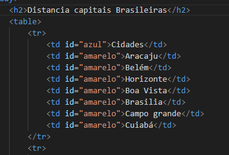
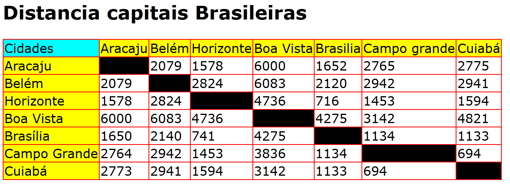

# Projeto - tabela de distancias

Projedo criado como parte avaliativa da disciplina de Fundamentos de Desenvolvimento minidrada pelo professor Leonardo Rocha.

## Índice

* [Descrição](#descrição)
* [Tecnologias](#tecnologia)
* [Referência](#referências)
* [Autor(a)](#autora)

### Descrição
O projeto consiste na composição de uma tabela que conta com capitais Brasileiras e a distância entre essas capitai. As capitais contastantes nesse projetos são:

* Aracaju
* Belém
* Horizonte
* Boa Vista
* Brasilia
* Campo grande
* Cuiabá

### Resultado do projeto

#### Tabela


* table- São objetos essenciais em um banco de dados, pois é nelas que ficam todas as informações ou dados.

* tr- Cria uma linha dentro de uma tag <table> e acomoda diversas tags <th> ou <td> que criam colunas dentro das linhas, formando uma tabela no documento.

* th- Define uma célula cabeçalho do grupo de células de sua tabela.

* td- Cria uma coluna para inserção de conteúdos, junto a diversas outras colunas em uma mesma linha (definida pela tag <tr> ), dentro do bloco de uma tabela.



### Estilização
 
O projeto foi estilizado usando o CSS3. Foi criando um arquivo chamado main.css. Nesse arquivo, constam conconfigurações de estilo apresentadas a seguir:
 
* Estilo de cores - A cor de fundo utilizada no projeto foi definida como segue:
 
```
#preto{
    background-color: black;
}
```

## Tecnologia

* HTML5
* CSS3
* README
* Git
* Github

## Referências

[Alura](https://www.alura.com.br/artigos/escrever-bom-readme) - Como escrever um README incrivel no seu Github

## Autor(a)
O projeto foi realizado por:
* Isabelly dos Reis Santos
* Ana Julia Oliveira Viana
* Larissa Aparecida Iuski
* Maria Luíza Farias da Silva
* Mariane Lima Remonte Viana
* Vitor Gabriel de Souza
* Vivian Oliveira Almeida
